# 第 1 课：边缘 AI 简介与 Jetson 硬件平台——基于 Jetson 的 reComputer 边缘 AI 入门实践

### 课程简介
在这一课中，我们将介绍边缘人工智能（Edge AI，以下简称边缘 AI）的基本概念、应用场景及其重要性。我们将探讨嵌入式系统、边缘计算等关键概念，了解 Jetson 硬件平台及其在边缘 AI 中的作用，熟悉 JetPack 操作系统的基本操作，并学习基本的 Linux 命令行。

# 课程目标
+ **理解边缘 AI 的基本概念和特点**
+ **了解边缘 AI 的应用场景及其在日常生活中的实例**
+ **初步认识 Jetson 硬件平台及其在边缘 AI 中的作用**
+ **熟悉 Jetpack 操作系统的基本操作**
+ **学会使用基本的 Linux 命令行**

---

# 1. 边缘 AI 简介
## 1.1. 常见术语解析

在开始学习边缘 AI 之前，我们需要先明确以下关键概念，并理解它们之间的联系。

### 1.1.1. 嵌入式系统

嵌入式系统（Embedded System）是一种专用于执行特定任务的计算机系统，内嵌于更大的系统中。它通常没有传统计算机的外观，没有键盘、显示器或鼠标，但同样具有处理器、存储器、输入和输出、软件等核心组件。如图 1.1 所示的插卡式嵌入式系统，带有处理器、内存、电源和外部接口。


> 图 1.1 带有 AM35x 处理器的 DHCOM 计算机模块

常见应用场景：

+ **家用电器**：如洗衣机、微波炉、电冰箱等。
+ **消费电子**：如智能手机、数码相机、游戏机等。
+ **汽车电子**：如发动机控制系统、车载导航系统等。
+ **医疗设备**：如心率监测器、血压计等。
+ **工业控制**：如自动化生产线、机器人等。

图 1.2 为嵌入式系统应用场景示意图。

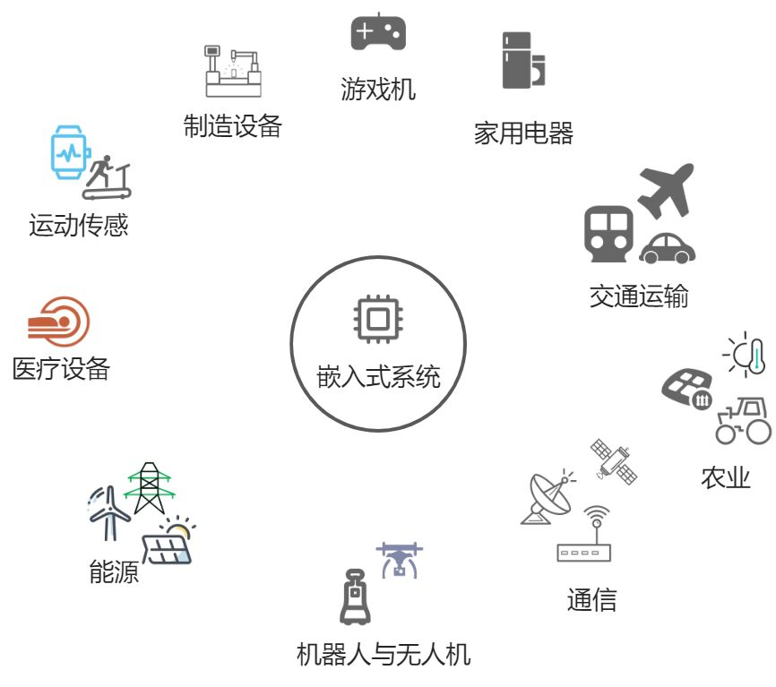

> 图 1.2 嵌入式系统应用场景示意图

> 希望进一步了解嵌入式系统可参考：[https://en.wikipedia.org/wiki/Embedded_system](https://en.wikipedia.org/wiki/Embedded_system)
>

嵌入式系统的规模可以非常小（如智能手表中的微控制器）或相对较大（如自动驾驶汽车中的高级控制系统）。它们的共同特点是针对特定任务进行优化，通常在资源受限的环境下运行。

**嵌入式系统的基本组成部分**：

+ **硬件：**
    - **处理器**：负责执行程序指令，可能是微控制器或微处理器。
    - **存储器**：用于存储程序代码和数据，包括 RAM 和 ROM 。
    - **输入/输出接口**：用于与外部世界交互，如传感器和执行器。
    - **电源管理**：管理系统的能量供应，可能包括电池管理、电源转换等。
    - **通信接口**：如 UART、SPI、I2C、USB、以太网等，用于与其他设备通信。
+ **软件：**
    - **固件**：存储在 ROM 中的程序，直接控制硬件。
    - **操作系统（可选）**：如实时操作系统（RTOS），提供任务调度和资源管理。
    - **驱动程序**：控制硬件组件的接口。
    - **应用程序**：实现具体的功能逻辑。

嵌入式系统通常受限于其部署环境，例如：

+ **能耗限制**：需要在电池供电的情况下长时间运行。
+ **物理尺寸限制**：需要嵌入到小型设备中。
+ **计算能力限制**：处理器性能和存储容量有限。

工程师在设计嵌入式系统时，需要在这些限制条件下优化性能和功能。

> **🔍思考**
>
> **你身边有哪些设备可能包含嵌入式系统？**
>

### 1.1.2. 边缘计算与物联网
+ 边缘计算（Edge Computing）是指在靠近数据源的地方（即“边缘”）进行数据处理和分析，而不是将数据发送到远程的数据中心或云端。这种方式可以降低延迟、节省带宽、提高数据安全性。
+ 物联网（Internet of Things，IoT）是指通过互联网将各种设备（传感器、执行器等）连接起来，实现数据的交换和通信。
+ 边缘设备是物联网中的重要组成部分，它们位于网络的边缘，直接与物理世界交互，如传感器节点、智能家居设备、可穿戴设备等。

图 1.3 为云与边缘的概念图，方便你理解边缘计算的流程。

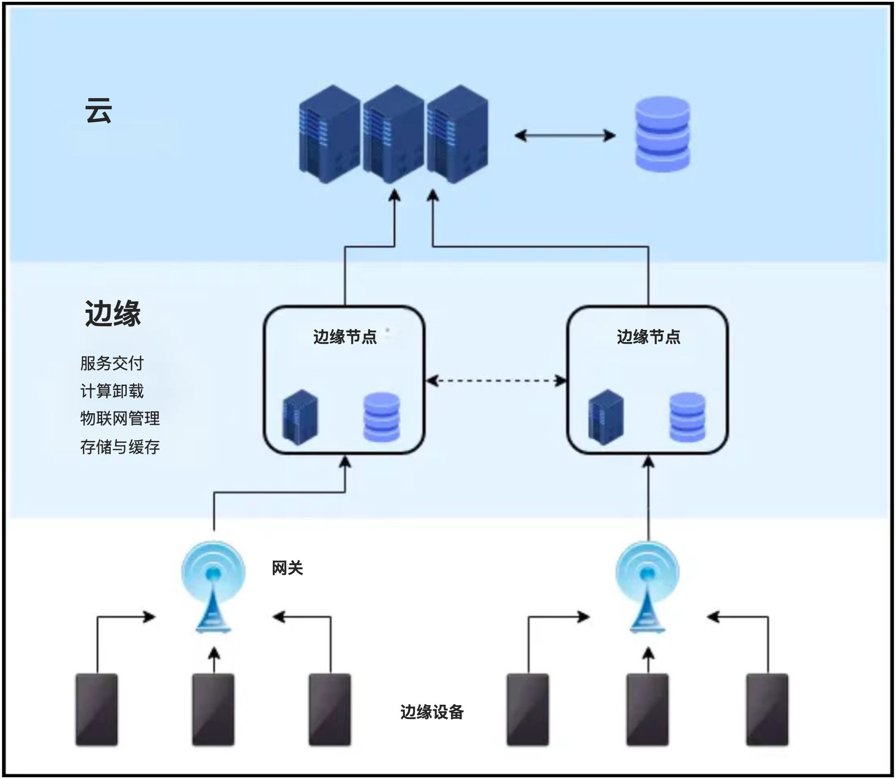

> 图 1.3 云与边缘的概念图解（图片来源 [维基百科](https://commons.wikimedia.org/wiki/File:Edge_computing_infrastructure.png)，作者：NoMore201 - 自创作品，CC BY-SA 4.0）
>

> 详情可参考：
>
> + [https://en.wikipedia.org/wiki/Edge_computing](https://en.wikipedia.org/wiki/Edge_computing)
> + [https://en.wikipedia.org/wiki/Internet_of_things](https://en.wikipedia.org/wiki/Internet_of_things)
>

### 1.1.3. 人工智能（AI）与机器学习（ML）
人工智能（Artificial Intelligence，AI）是计算机科学的一个分支，旨在使机器具备模拟人类智能的能力，包括学习、推理、感知、理解自然语言等。

机器学习（Machine Learning，ML）是实现人工智能的一种方法，它通过数据和统计方法，使计算机能够自动改进其性能。机器学习算法能够从数据中学习规律，并对未知数据进行预测或决策。

> 详情可参考：
>
> + [https://en.wikipedia.org/wiki/Artificial_intelligence](https://en.wikipedia.org/wiki/Artificial_intelligence)
> + [https://en.wikipedia.org/wiki/Machine_learning](https://en.wikipedia.org/wiki/Machine_learning)
>

### 1.1.4. 边缘人工智能（边缘 AI）
边缘 AI 是将人工智能算法部署在边缘设备上，使其能够在本地处理数据、进行推理和决策，而无需将数据发送到云端。这种方式具有以下优势：

+ **低延迟**：实时处理，适用于对时间敏感的应用，如自动驾驶。
+ **节省带宽**：减少数据传输量，降低网络负载。
+ **增强隐私和安全**：数据本地处理，降低数据泄露的风险。
+ **离线工作**：无需持续网络连接，设备可在网络不稳定或无网络的环境下运行。

### 1.1.5. 嵌入式机器学习（Embedded ML）
嵌入式机器学习是在嵌入式系统上运行机器学习模型的艺术和科学。当我们谈论嵌入式机器学习时，我们通常指的是机器学习推理——输入数据和做出预测的过程（例如根据加速度计数据猜测运动状态），而训练部分通常仍然在传统计算机上进行。

另外，嵌入式系统通常内存有限，这给许多类型的机器学习模型的运行带来了挑战，这些模型通常对只读存储（存储模型）和 RAM（处理推理期间生成的中间结果）都有很高的要求，它们在计算能力方面也经常受到限制。由于许多类型的机器学习模型在计算上相当密集，这也可能会引起问题。

### 1.1.6. 微型机器学习（TinyML）
TinyML 则是进一步在最受限制的嵌入式硬件，如微控制器、数字信号处理器和现场可编程门阵列（Field Programmable Gate Array，简称 FPGA）上实现机器学习的推理过程。

图 1.4 有助于更好的理解上面这些术语之间的关系。

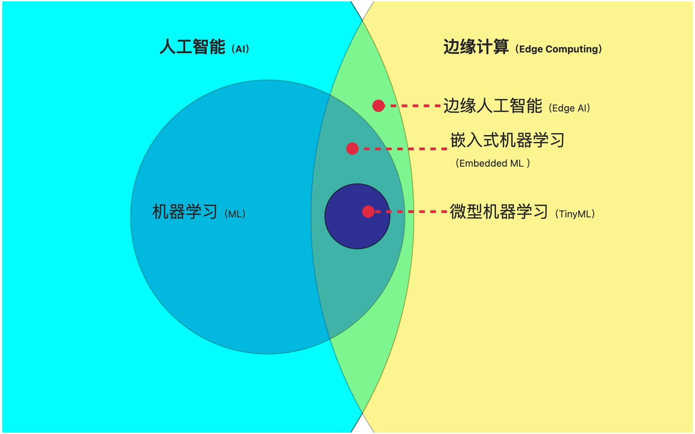

> 图 1.4 人工智能与边缘计算常见术语之间的关系
>

+ 人工智能（就是我们常说的 AI）：涵盖广泛的智能技术。
+ 机器学习（ML）：作为AI的一个子集，专注于通过数据进行自我改进。
+ 边缘人工智能（Edge AI，简称边缘 AI）： 是人工智能和边缘计算的交集，在靠近数据源的设备上处理AI任务，减少数据传输的延迟。
+ 嵌入式机器学习（Embedded ML）：是机器学习和边缘计算的交集，将机器学习模型嵌入到设备中，在资源有限的环境下运行。
+ 微型机器学习（TinyML）：是嵌入式机器学习的子集，专为低功耗、低存储的设备设计，能够让我们在边缘设备上运行复杂的AI模型。

## 1.2. 边缘 AI 的优势及运作过程
### 1.2.1. 边缘 AI 的优势
+ **带宽节省**：减少了将大量原始数据上传到云端的需求。
+ **降低延迟**：实时处理，提高响应速度。
+ **提高可靠性**：本地处理降低了对网络连接的依赖。
+ **增强隐私**：敏感数据不离开设备，保护用户隐私。
+ **降低成本**：减少了云计算和数据传输的费用。

### 1.2.2. 边缘 AI 的运作过程
开发一个边缘 AI 项目,我们通常需要经过以下步骤：

1. 问题定义：需要明确我们要解决什么问题,以及具体的技术需求和目标。
2. 数据准备：收集相关数据,进行数据清洗和标注,为模型训练做好准备。
3. 模型训练：在高性能服务器上,使用准备好的数据训练 AI 模型。
4. 模型优化与部署：将模型压缩优化,并部署到边缘设备上。
5. 本地推理与应用：在边缘设备上实时采集数据,进行本地 AI 推理，并将推理结果与实际应用结合。
6. 监控与优化：持续监控系统运行状态,收集反馈并进行优化。

图 1.5 为边缘 AI 工作流程示意图，便于你理解上述的步骤。


> 图 1.5 边缘 AI 项目工作流程示意图
>


## 1.3. 边缘 AI 的应用
**边缘 AI** 正在各个行业中迅速发展，为设备和系统赋予智能，使其能够在本地实时处理数据和做出决策。通过将 AI 能力下放到边缘设备，许多传统行业和新兴领域都得到了革新，提高了效率、安全性和用户体验。以下我们将介绍边缘 AI 在几个主要领域的具体应用。

### 1.3.1. 智能家居
+ **语音控制**：智能音箱本地识别语音指令，快速响应用户需求。
+ **安全监控**：摄像头本地识别人脸和异常行为，提高安全性。

图 1.6 为家门访客检测实例。

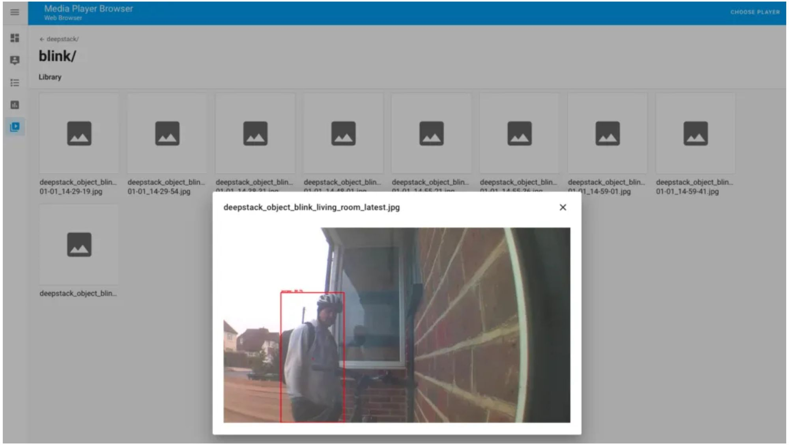

> 图 1.6 家门访客检测实例
>

### 1.3.2. 自动驾驶
+ **实时感知**：车辆传感器本地处理环境数据，实现自主导航和避障。
+ **决策控制**：快速计算，确保行车安全。

图 1.7 为自动驾驶的清洁车实例图。

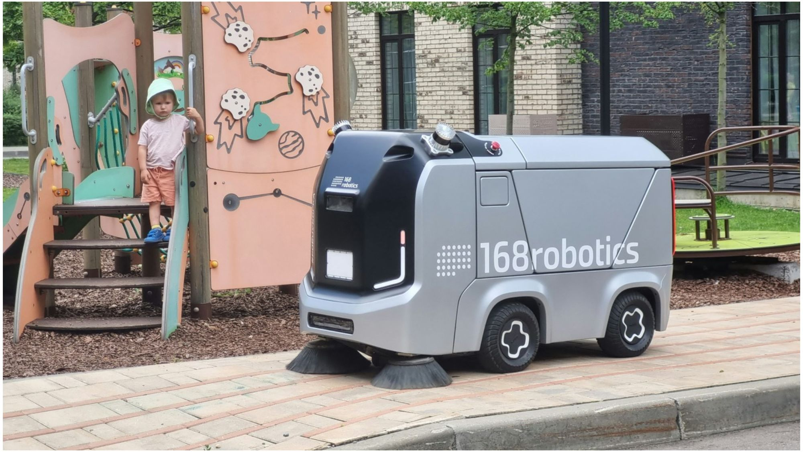

> 图 1.7 自动驾驶的清洁车实例图

### 1.3.3. 工业物联网
+ **设备预测性维护**：本地分析设备运行数据，预测故障，减少停机时间。
+ **质量检测**：生产线实时检测产品质量，提高生产效率。
+ **安全检测**：检测现场人员是否佩戴安全帽或者仓库人员流动等情况。

图 1.8 为仓库人员检测实例。

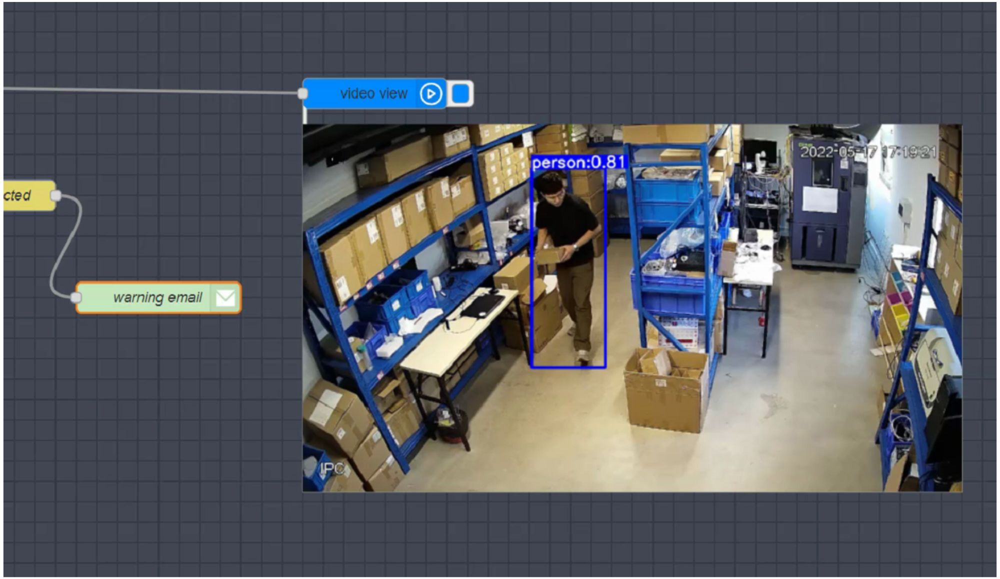

> 图 1.8 仓库人员检测
>

---

# 2. NVIDIA Jetson 硬件平台简介
## 2.1. NVIDIA Jetson 概述
**NVIDIA Jetson** 系列是专为边缘 AI 和嵌入式系统设计的高性能硬件平台。平台提供了强大的计算能力，支持复杂的 AI 模型和算法。

图 1.9 为 NVIDIA Jetson 系列产品图：

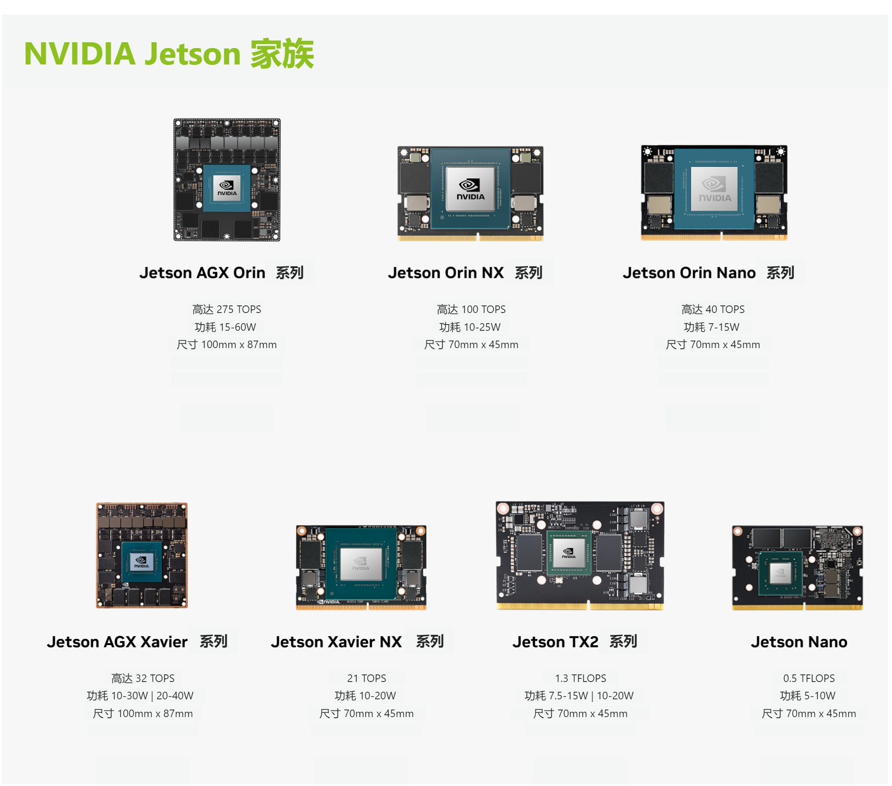

> 图 1.9 NVIDIA Jetson 系列产品图片
>

> 详情可参考：[https://developer.nvidia.com/embedded-computing](https://developer.nvidia.com/embedded-computing)
>

### 2.1.1. Jetson Nano
**Jetson Nano**是 Jetson 家族的入门级产品，具有以下特点：

+ **高性能**：搭载四核 ARM Cortex-A57 CPU 和128核 NVIDIA Maxwell GPU，适合运行深度学习和计算机视觉算法。
+ **低功耗**：功耗仅为5~10瓦，适合嵌入式和移动应用。
+ **丰富的接口**：提供 USB、HDMI、以太网、GPIO 等接口，方便连接各种传感器和外设。
+ **开发友好**：支持 Linux 操作系统，提供丰富的开发工具和文档。

图 1.10 为 Jetson Nano 的实物图。

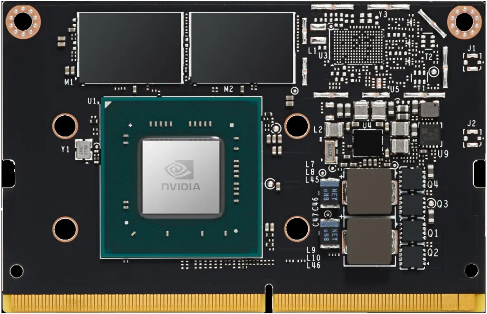

> 图 1.10 Jetson Nano 实物图
>

### 2.1.2. reComputer J1020 v2
**reComputer J1020 v2** 是基于 Jetson Nano 核心模块的开发套件，具有以下特点：

+ **小巧强大**：体积小巧，但内置了 Jetson Nano 模块，具备强大的 AI 计算能力。
+ **低功耗**：适合长时间运行，节能环保。
+ **丰富的接口**：配备 USB、HDMI、以太网、GPIO 等，方便连接多种外设和传感器。

图 1.11 为 reComputer J1020 v2 产品外观。

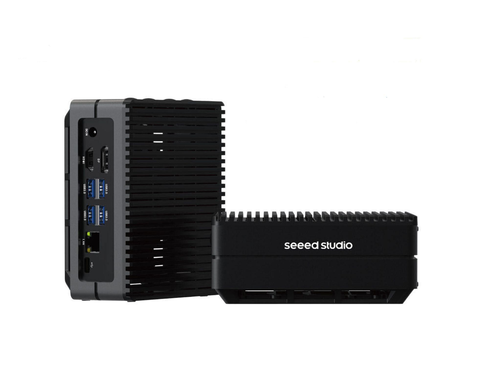

> 图 1.11 reComputer J1020 v2 整体图
>

图 1.12 展示了一个去掉顶部面板的 reComputer J1020 v2，Jetson Nano 模块位于图中带高温警告标识的黑色散热器的下面。

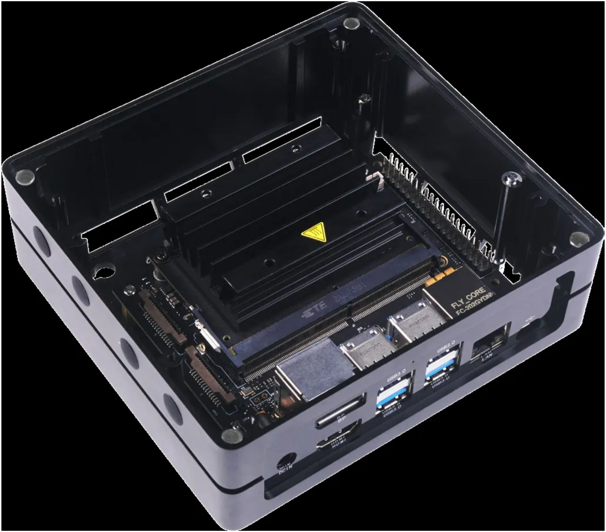

>图 1.12 去掉顶部面板的 reComputer J1020 v2
>

reComputer J1020 V2 内部使用 reComputer J202 载板连接 Jetson Nano。图 1.13 展示了  reComputer J202 载板正面和背面的功能示意图。

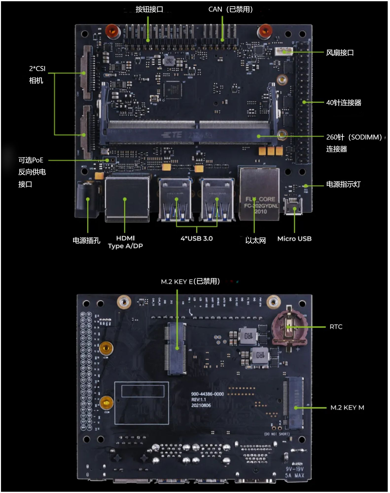

> 图 1.13 reComputer J202 载板的正面与背面的功能示意图（未接 Jetson Nano 模块）
>

图 1.14 展示了 reComputer J1020 V2 内部使用的散热器模块，Jetson Nano 在工作状态下会发热，需要依赖散热器进行降温。

> 注意：在开机状态下，避免用手触碰散热器，高温可能导致烫伤。
>

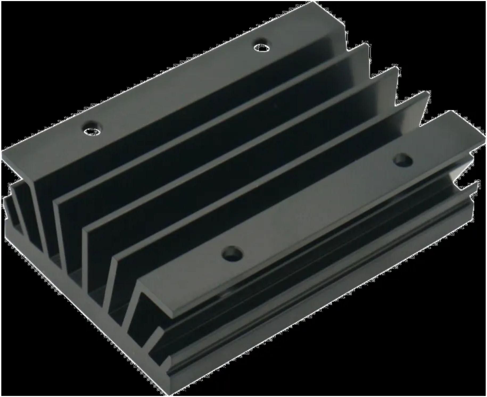

> 图 1.14 reComputer J1020 V2 散热器实物图
>


> 详情可参考：
>
> + [https://wiki.seeedstudio.com/reComputer_J1020v2_with_Jetson_getting_start/](https://wiki.seeedstudio.com/reComputer_J1020v2_with_Jetson_getting_start/)
> + [reComputer Jetson-10-1-H0 datasheet (seeedstudio.com)](https://files.seeedstudio.com/wiki/reComputer-Jetson/reComputer-Jetson-J1020-w_o-power-adapter-datasheet.pdf)
>

### 2.1.3. Jetson 的应用实例
随着边缘计算和人工智能技术的快速发展，NVIDIA Jetson 平台在众多领域的应用越来越广泛。Jetson 的高性能计算能力和强大的 AI 支持，使其成为构建智能设备的理想平台，能够在本地实时处理数据并做出智能决策。以下是几个典型的应用场景，展示了 Jetson 平台在智能机器人、无人机和智能监控领域的应用。

+ **智能机器人**：利用 Jetson 平台的强大计算能力，实现机器人自主导航、物体识别、路径规划等功能。

图 1.15 为 Jetson 驱动的自动驾驶机器人。


> 图 1.15 Jetson 驱动的自动驾驶机器人
>

+ **无人机**：在无人机上部署边缘 AI，实现实时目标跟踪、自主避障和环境感知。

图 1.16 为无人机示意图。


> 图 1.16 无人机
>

+ **智能监控**：利用 Jetson 平台进行视频分析，实现物品分类、人脸识别、行为检测等应用。

图 1.17 为运行在 Jetson 平台上的物体分类实例。

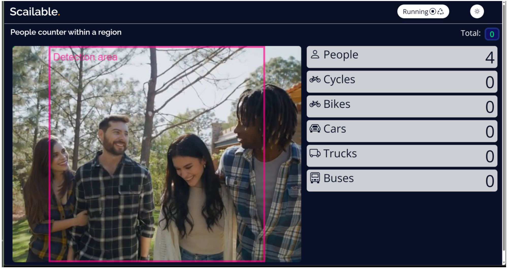

> 图 1.17 运行在 Jetson 平台上的物体分类实例
>

# 3. JetPack 软件开发套件
## 3.1. JetPack SDK 简介
JetPack SDK 是 NVIDIA 为 Jetson 平台推出的官方软件开发套件。它为开发者提供了一个完整的端到端解决方案，用于构建加速的 AI 应用程序，显著缩短产品的开发周期和上市时间。JetPack 集成了操作系统、驱动程序、库、示例和文档，帮助开发者充分发挥 Jetson 硬件的性能。

## 3.2. JetPack 的作用
**JetPack 的主要作用**是为 Jetson 平台提供一个高度集成的开发环境，涵盖从底层硬件支持到高层应用开发的各个方面。具体而言，JetPack：

+ **提供操作系统支持**：基于 Ubuntu（乌班图）的定制操作系统，包含针对 Jetson 硬件优化的内核和驱动程序。
+ **集成 AI 和深度学习库**：包括 CUDA、cuDNN、TensorRT 等 GPU 加速库，支持高性能计算和深度学习应用。
+ **提供多媒体和计算机视觉支持**：集成了多媒体 API、OpenCV 等库，方便开发图像和视频处理应用。
+ **包含开发工具和调试器**：如 NVIDIA Nsight，用于调试和性能分析。
+ **提供示例代码和文档**：帮助开发者快速上手，降低学习曲线。

## 3.3. JetPack SDK 的版本与兼容性
JetPack SDK 随着 Jetson 硬件的发展不断更新，以支持最新的硬件特性和软件功能。主要的 JetPack 版本及其兼容性如下：

### JetPack 4.x 系列
+ **特点**：基于 Ubuntu 18.04，支持较早的 Jetson 硬件。
+ **支持的硬件**：Jetson Nano、Jetson TX1、Jetson TX2、Jetson AGX Xavier 等。
+ **主要组件**：CUDA 10.x、cuDNN 7.x、TensorRT 6.x 等。

### JetPack 5.x 系列
+ **特点**：引入了更多的性能优化和新特性。
+ **支持的硬件**：Jetson Xavier NX、Jetson AGX Xavier、部分 Orin 系列设备。
+ **主要组件**：CUDA 11.x、cuDNN 8.x、TensorRT 7.x 等。

### JetPack 6.x 系列
+ **特点**：这是 JetPack 的最新重大版本升级，带来了更新的内核和更丰富的功能。
+ **支持的硬件**：Jetson Orin 系列，包括 Jetson AGX Orin、Jetson Orin NX、Jetson Orin Nano 等。
+ **主要组件**：CUDA 12.x、cuDNN 9.x、TensorRT 10.x 等。
+ **新特性**：
    - 基于 Ubuntu 22.04 的根文件系统。
    - 支持 Linux Kernel 5.15。
    - 引入 Jetson AI Stack，可独立于 Jetson Linux 更新。
    - 增强的安全特性，如支持固件级可信平台模块（fTPM）。

> **注意**：在选择 JetPack 版本时，需要根据所使用的 Jetson 硬件型号和开发需求，选择合适的版本以确保兼容性。
>

在本课程中，我们使用的 **JetPack 版本为 JetPack 4.6.5**，该版本是基于 Ubuntu 18.04 的，专门为 Jetson Nano 及其他 Jetson 设备优化，支持运行深度学习、计算机视觉等各种 AI 应用。请注意，JetPack 的不同版本会有不同的特性和支持的硬件，因此在学习过程中，务必使用我们指定的版本（JetPack 4.6.5）。  

## 3.4. NVIDIA JetPack 的三个主要组件
NVIDIA JetPack 包括 3 个组件：

1. **Jetson Linux**：一个板级支持包（BSP），包括引导程序、Linux 内核、Ubuntu 桌面环境、NVIDIA 驱动程序、工具链等。此外还提供安全性和空中升级（OTA）功能。
2. **Jetson AI 堆栈**：基于 CUDA 的加速 AI 堆栈，包含用于 GPU 计算、多媒体、图形和计算机视觉加速的完整库集。支持应用框架，如 Metropolis（构建和扩展视觉 AI 应用）、Isaac（用于高性能机器人应用）以及 Holoscan（用于边缘到云的高性能计算和实时传感器处理）。
3. **Jetson 平台服务**：一组现成可用的服务，加速 Jetson 上的 AI 应用开发。

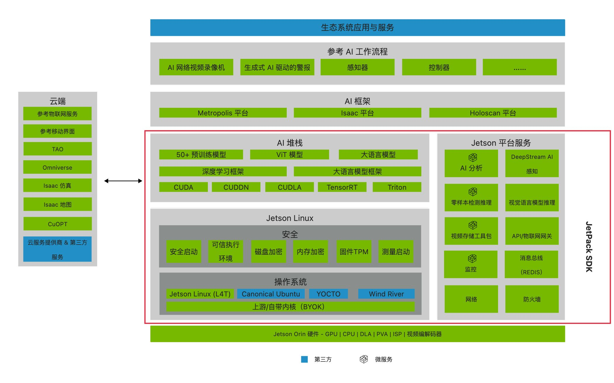

图片来源：[https://developer.nvidia.com/embedded/develop/software](https://developer.nvidia.com/embedded/develop/software)

> 详细可参考 NVIDIA 官网：
>
> + [https://developer.nvidia.com/embedded/learn/get-started-jetson-nano-devkit#setup](https://developer.nvidia.com/embedded/learn/get-started-jetson-nano-devkit#setup)
> + [https://developer.nvidia.com/embedded/jetpack](https://developer.nvidia.com/embedded/jetpack)
>

# 4. 实践：基本操作和命令行
## 4.1. reComputer J1020 设备的基本操作
### 4.1.1. 设置设备
> 注意：reComputer J1020 设备可以视为一个可独立运行的个人电脑，所以学习本课程可以无需额外的电脑，但需要为其外接显示器、鼠标和键盘 。
>

**设置步骤**

reComputer J1020 的接口说明请参考图 1.18，连接示意请参考图 1.19。

1. **连接外设**：
+ **显示器**：通过 HDMI 接口（或 DP 接口）连接显示器。
+ **键盘和鼠标**：连接到 USB 接口。
+ **网络**：连接网线（由于设备不含 Wi-Fi 模块）。
2. **连接电源**：
+ 在确定已连接所有外设后，使用提供的电源线连接设备，设备将自动启动。

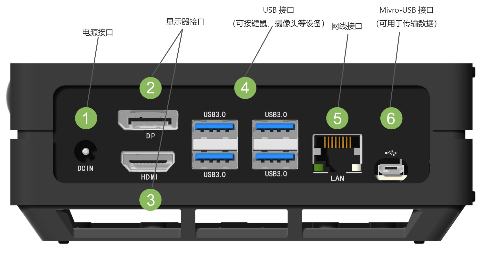

> 图 1.18 reComputer J1020 v2 接口示意图
>

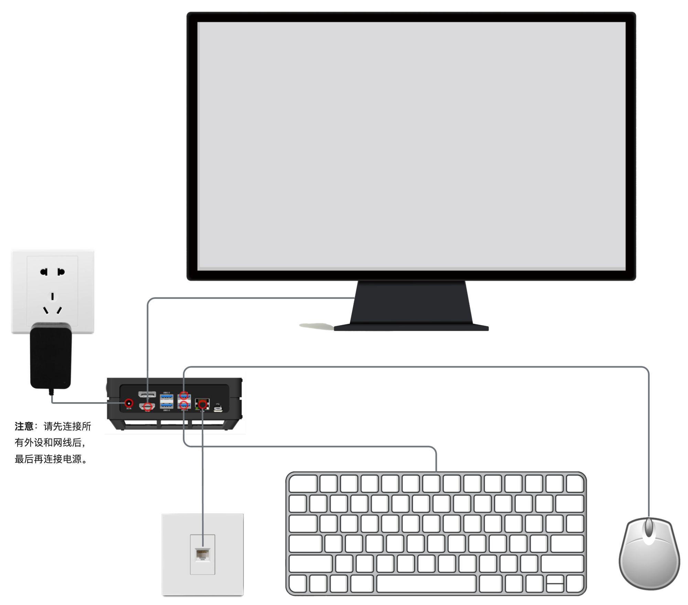

> 图 1.19 reComputer J1020 的外设连接示意图，注意确保所有外设和网线连接后，再连接电源给 reComputer 上电
>

### 4.1.2. 首次启动设置
+ 设备通电后即可自行启动。首次启动时，Jetson Nano 将引导您完成一些初始设置，包括：
    - 查看并接受 NVIDIA Jetson 软件 EULA。
    - 选择系统语言、键盘布局和时区。
    - 创建用户名、密码和计算机名称。

### 4.1.3. 登录系统
+ 完成初始设置后，将进入系统桌面。现在，你的 reComputer 已准备就绪，桌面如图 1.20 所示。

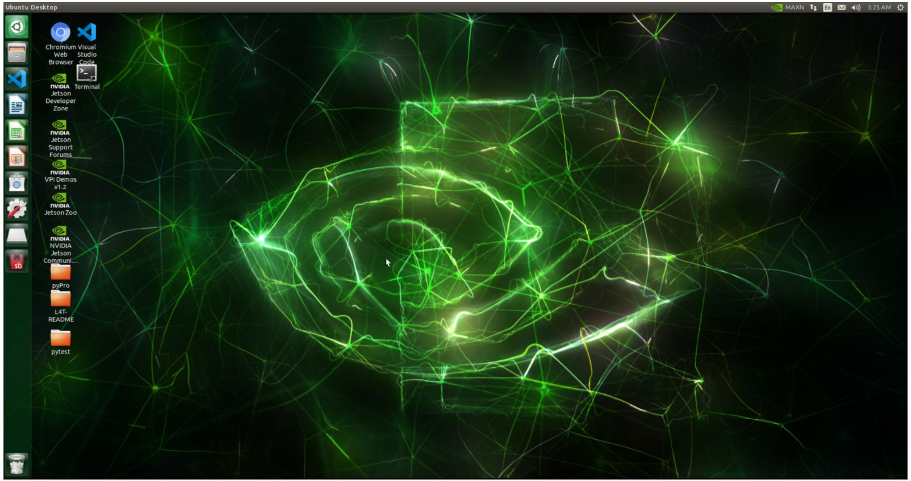

> 图 1.20 reComputer J1020 v2 登录后的桌面
>

## 4.2. 桌面环境介绍
### 4.2.1. reComputer J1020 v2 桌面整体布局介绍
图 1.21 展示了 NVIDIA Jetson 平台上基于 Ubuntu 的桌面环境布局：

+ **左侧的任务栏和菜单**：显示了一些常用的应用程序快捷方式和文件夹，包括文件管理器、浏览器、Jetson 支持工具以及各种开发工具等。任务栏上的图标可以帮助用户快速访问应用程序。
+ **右上角的系统设置**：显示了当前的系统状态，包括电源管理、网络连接、音量控制等设置，方便用户进行系统配置。
    - **MAXN**：显示了系统的性能模式（如 MAXN 模式）。
    - **系统设置图标**：可以快速访问系统设置，调整网络、音量、屏幕亮度等系统参数。

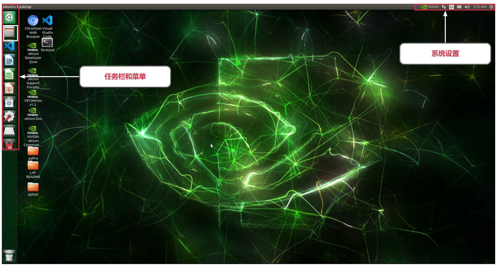

> 图 1.21 reComputer J1020 v2 桌面环境介绍图
>


### 4.2.2. reComputer J1020 v2 主要功能区域介绍
+ **任务栏和菜单**：任务栏显示正在运行的应用程序；主菜单包含各种应用程序和系统设置。

图 1.22 为应用程序菜单实例图，应用程序菜单的作用是允许用户访问已安装的应用程序和系统设置 。

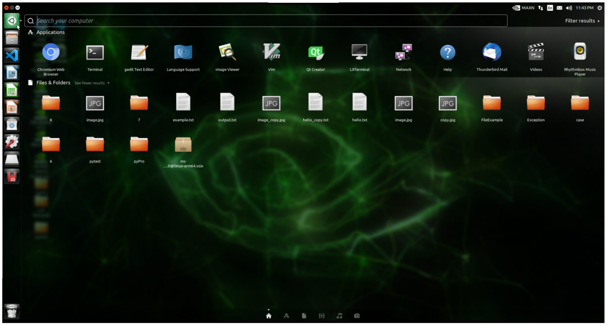

> 图 1.22 应用程序菜单实例图
>


+ **文件管理器**：用于浏览和管理文件和文件夹。

图 1.23 为文件管理器实例图：

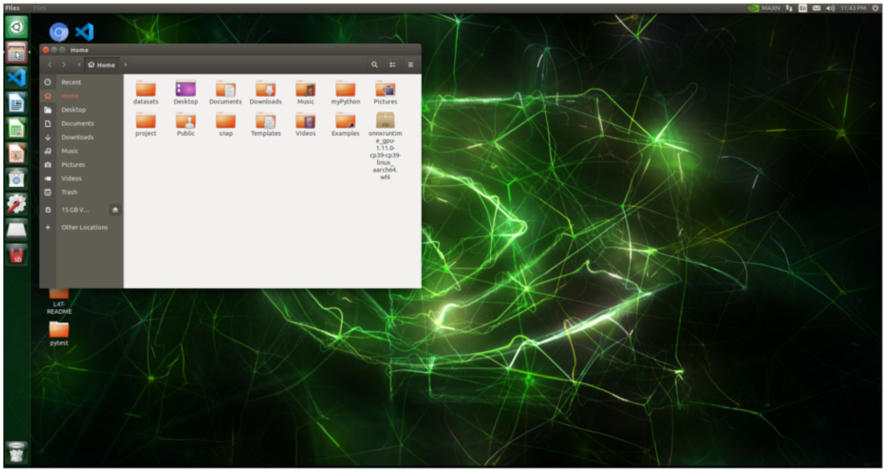

> 图 1.23 文件管理器实例图
>


+ **系统设置**：可调整网络连接、显示设置、用户账户等系统参数。

图 1.24 为系统设置界面实例图：

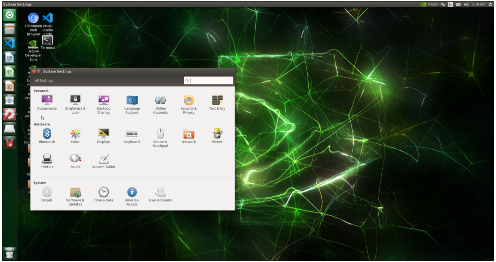

> 图 1.24 系统设置实例图
>

### 4.2.3. reComputer J1020 v2 网络连接演示
> ⚠️ 注意：reComputer J1020 v2 没有安装wifi模块，**因此需要网线才能联网。**
>

如果想设置网络连接可以进行下图的操作：

- 方法一：
1. 如图 1.25 所示，进入系统设置界面，找到 Network 图标，点击进入。

> 备注：在 System Settings 也可以对显示、蓝牙、语言等功能进行设置，可以按照自己的喜好自行配置。

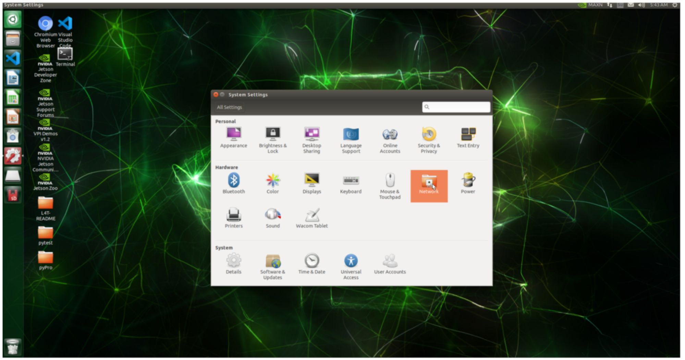

> 图 1.25 System Settings 中的 Network 的位置示意图 

2. 如图 1.26 所示，插入网线后，选择正确的 Wired 打开即可实现网络连接。

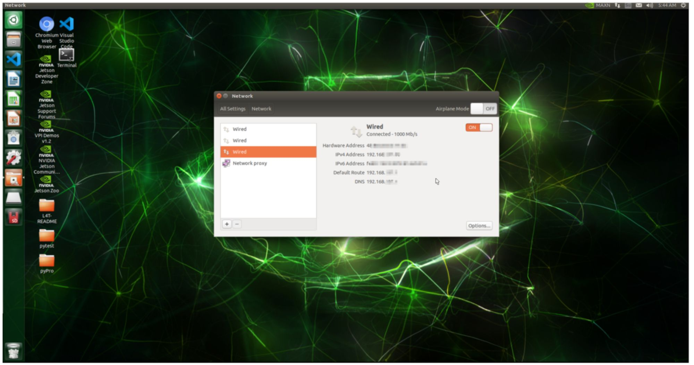

> 图 1.26 网络连接操作示意图


- 方法二：

如图 1.27，也可以通过点击右上角的双箭头图标，然后点击‘Wired connection’实现网络连接。

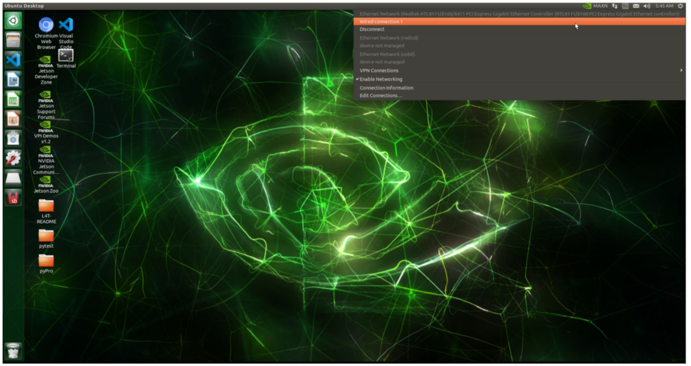

> 图 1.27 简易网络连接操作示意图
>


### 4.2.4. 使用终端和基本命令
+ **终端的作用**：终端是与系统交互的重要工具，可以执行各种命令，管理文件和程序。
+ **提示符的含义**：例如：`user@jetson:~$`，表示当前用户名、主机名和所在目录。
+ **打开终端**：在桌面环境中，点击终端图标或使用快捷键`Ctrl + Alt + T`。

如图 1.28 所示，点击终端图标打开终端。

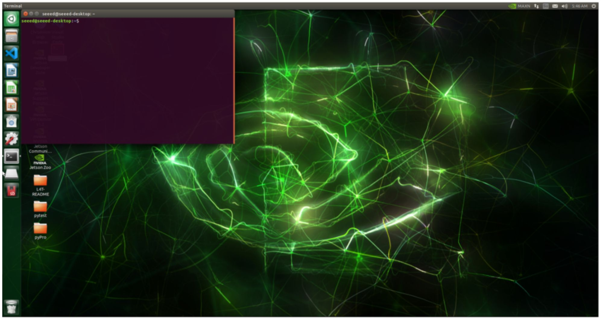

> 图 1.28 打开终端流程图
>

### 4.2.5. 基本命令介绍
终端通过命令与系统交互，下面是一些常用命令：

---

#### 目录操作命令
+ `ls`：查看目录内容
+ `cd`：切换目录
+ `pwd`：显示当前位置
+ `mkdir`：创建目录

实际应用：在管理AI项目文件时，这些命令能帮助我们快速定位和浏览项目结构。

#### 文件操作命令
+ `touch`：创建空文件
+ `cp`：复制文件
+ `mv`：移动或重命名文件
+ `rm`：删除文件（⚠️特别注意：此命令删除的文件无法恢复，使用时需要特别小心）

实际应用：在处理训练数据集时，这些命令可以帮助我们整理和管理数据文件。

#### 文件内容操作
+ `nano`：编辑文件
+ `cat`：查看文件内容
+ `find`：查找文件
+ `grep`：搜索文件内容

实际应用：在调试AI模型配置文件时，这些命令可以帮助我们快速修改和检查参数。

---

下面介绍如何使用这些常用命令。

+ `ls`：列出当前目录下的文件和文件夹。
    - **示例：**

    ```bash
    ls
    ```

图 1.29 为使用 `ls` 指令的实例图，列出主目录下的文件和文件夹。

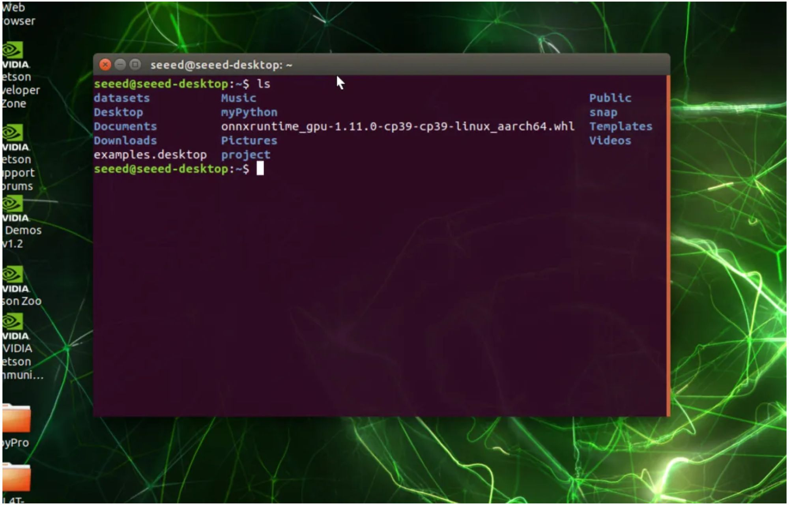

> 图 1.29 `ls` 指令实例图
>


+ `cd`：切换目录。
    - **用法：**
    ```bash
    cd [目录名]
    ```

    - **示例：**

    ```bash
    cd dirname   # 进入名为dirname的目录
    cd ..        # 返回上一级目录
    ```

图 1.30 为使用 `cd` 指令的实例图，使用该指令在主目录与Music目录之间切换

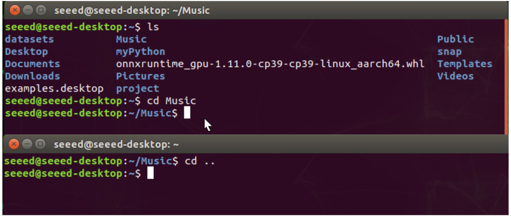

> 图 1.30 `cd` 指令实例图
>


+ `pwd`：显示当前所在的目录路径。
    - **示例：**

    ```bash
    pwd # 输出当前目录的绝对路径
    ```

图 1.31 为使用 `pwd` 指令的实例图，显示出了当前所在的路径。

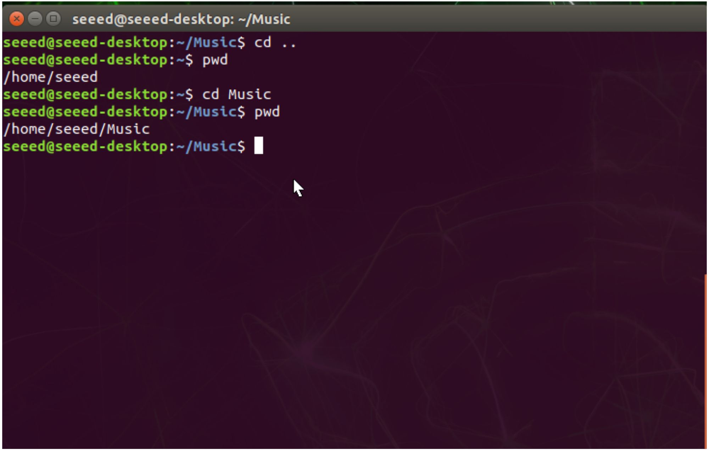

> 图 1.31 `pwd` 指令实例图
>


+ `mkdir`：创建新目录。
    - **用法：**

    ```bash
    mkdir [目录名]
    ```

    - **示例：**

    ```bash
    mkdir dirname  # 创建名为dirname的目录
    ```

图 1.32 为使用 `mkdir` 指令的实例图，从图中可以看出我们在 Home 文件夹中创建了一个 test 文件夹。

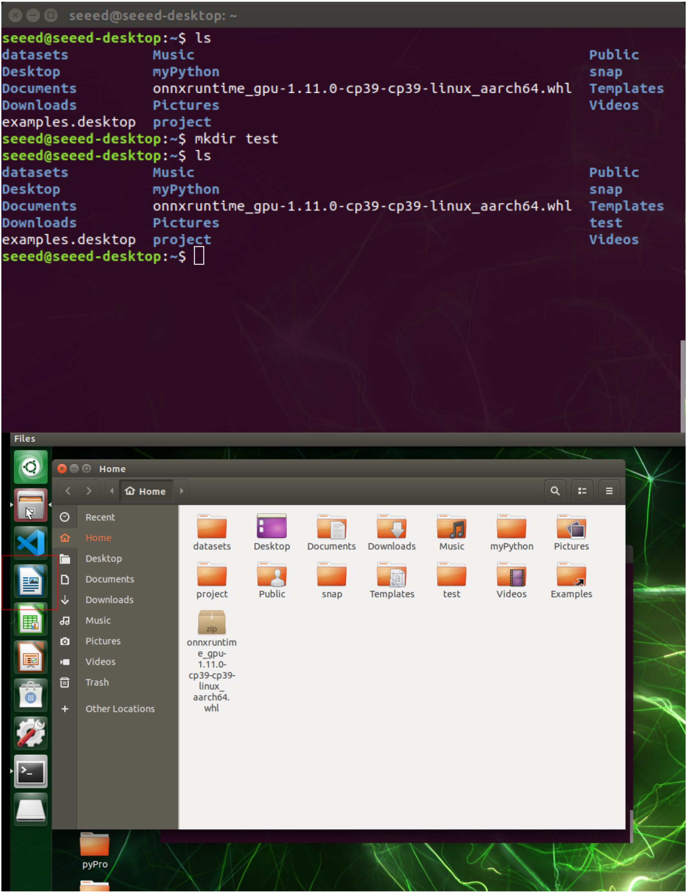

> 图 1.32 `mkdir` 指令实例图
>


+ `touch`：创建新文件。
    - **用法：**

    ```bash
    touch [文件名]
    ```

    - **示例：**

    ```bash
    touch filename  # 创建名为filename的空文件
    ```

图 1.33 为使用 `touch` 指令的实例图，从图中可以看出我们在 test 文件夹中创建了一个名为 test1 的文件。


> 图 1.33 `touch` 指令实例图
>


+ `rm`：删除文件或目录。
    - **用法：**

    ```bash
    rm [文件名]
    ```

    - **示例：**

    ```bash
    rm unwantedfile.txt # 删除unwantedfile.txt文件
    ```

图 1.34 为使用 `rm` 指令的实例图，可以看出指令执行后，test1 文件已被删除。

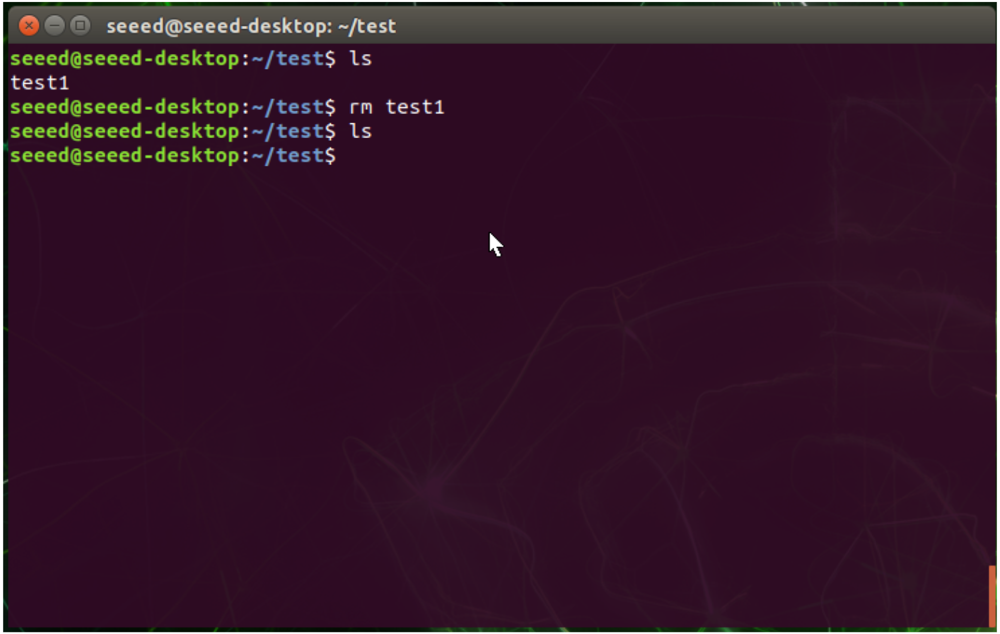

> 图 1.34 `ls` 指令实例图
>


+ `cp`：复制文件或目录。
    - **用法：**

    ```bash
    cp [源文件] [目标文件]
    ```

    - **示例：**

    ```bash
    cp file1.txt file2.txt # 将file1.txt复制为file2.txt
    ```

图 1.35 为使用 `cp` 指令的实例图，将 test1.txt 文件复制到 test2.txt 文件中。

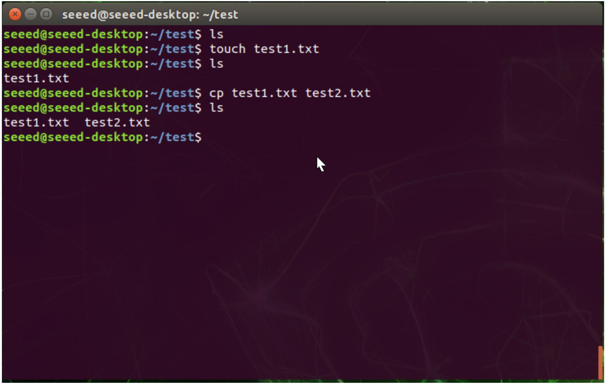

> 图 1.35 `cp` 指令实例图
>


+ `mv`：移动或重命名文件。
    - **用法：**

    ```bash
    mv [源文件] [目标文件]
    ```

    - **示例：**

    ```bash
    mv oldname.txt newname.txt # 将oldname.txt重命名为newname.txt
    ```

图 1.36 为使用 `mv` 指令的实例图，此处为将 test1.txt 文件重命名为 new.txt 文件。

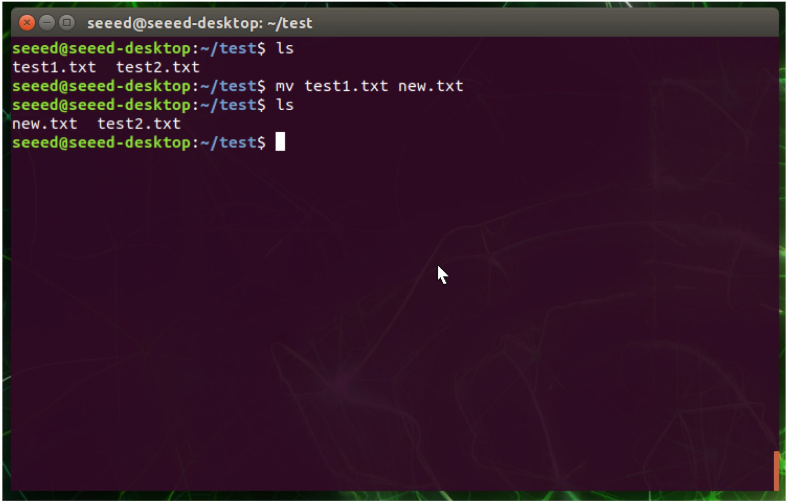

> 图 1.36 `mv` 指令实例图
>


+  `nano`：编辑文件内容的命令  
    - 用法：

    ```bash
    nano [文件名]
    ```

    -  示例：

    ```bash
    nano readme.txt # 打开并编辑 readme.txt 文件的内容
    ```

> 备注：在打开的编辑器中，可以输入或修改文本内容。编辑完成后，按 `Ctrl+O` 保存文件，按 `Enter` 确认，然后按 `Ctrl+X` 退出编辑器。
>

图 1.37 为使用 `nano` 指令的实例图，编辑 `readme.txt` 文件的内容。

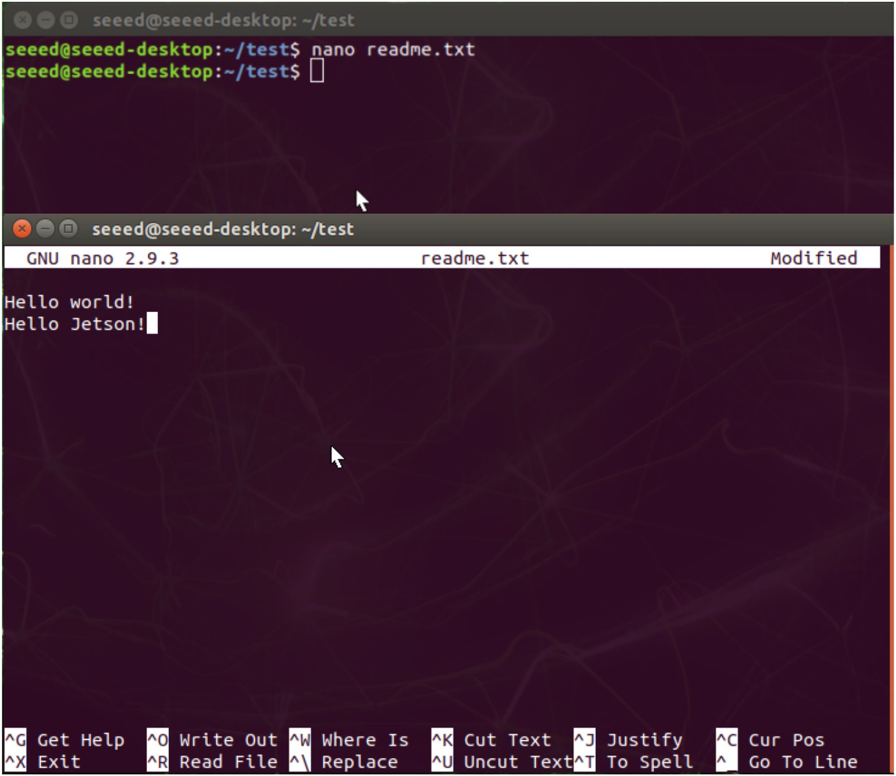

> 图 1.37 `nano` 指令实例图
>


+ `cat`：查看文件内容或连接文件。
    - **用法：**

    ```bash
    cat [文件名]
    ```

    - **示例：**

    ```bash
    cat readme.txt # 显示readme.txt文件的内容
    ```

图 1.38 为使用 `cat` 指令的实例图，查看readme.txt 文件的内容。

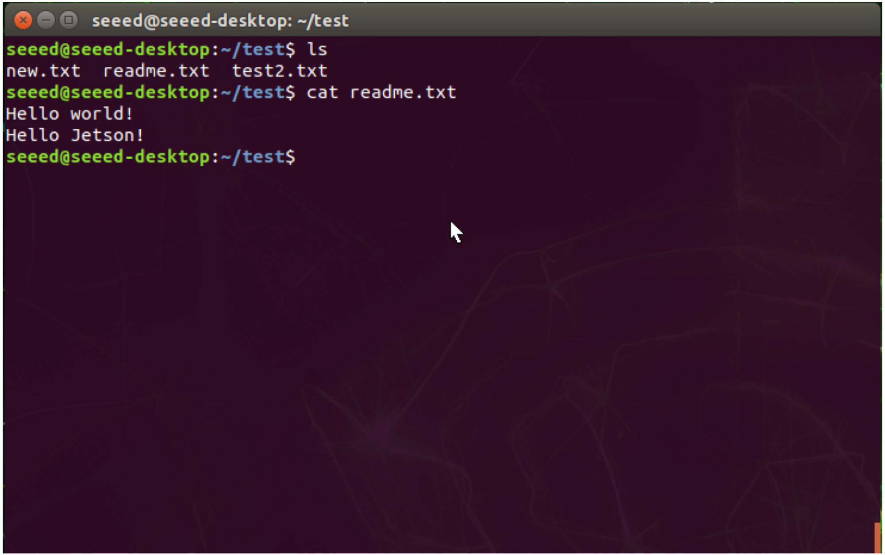

> 图 1.38 `cat` 指令实例图
>


+ `find`：在文件系统中查找文件或目录。
    - **用法：**

    ```bash
    find [搜索路径] [搜索条件]
    ```

    - **示例：**

    ```bash
    find /home -name myfile.txt # 在/home目录下查找名为myfile.txt的文件
    ```

图 1.39 为使用 `find` 指令的实例图，在 /home/seeed/test 路径下查找了 readme.txt 文件。

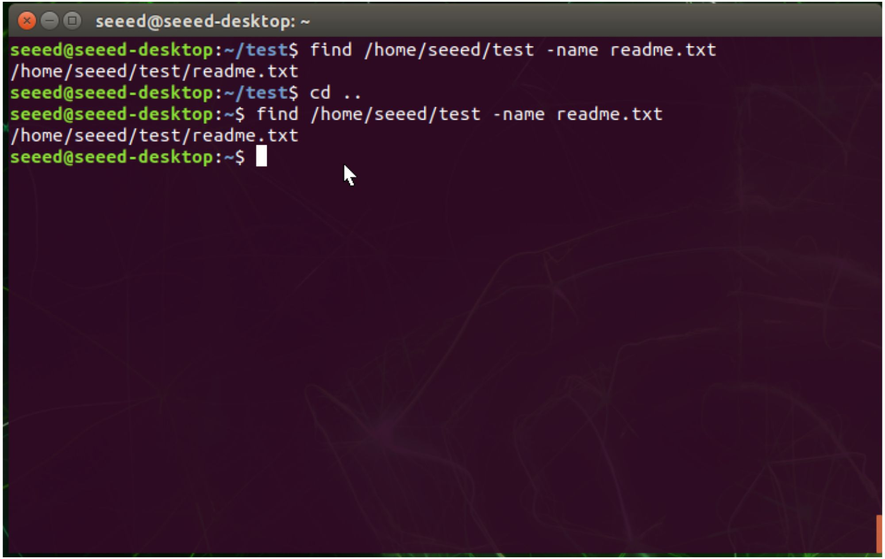

> 图 1.39 `find`指令实例图
>


+ `grep`：在文件中搜索指定的文本模式。
    - **用法：**

    ```bash
    grep [模式] [文件名]
    ```

    - **示例：**

    ```bash
    grep 'Hello' readme.txt # 在readme.txt文件中搜索包含"Hello"的行
    ```

图 1.40 为使用 `grep` 指令的实例图，在 readme.txt 文件中搜索 Hello world！与 Hello 的文本。

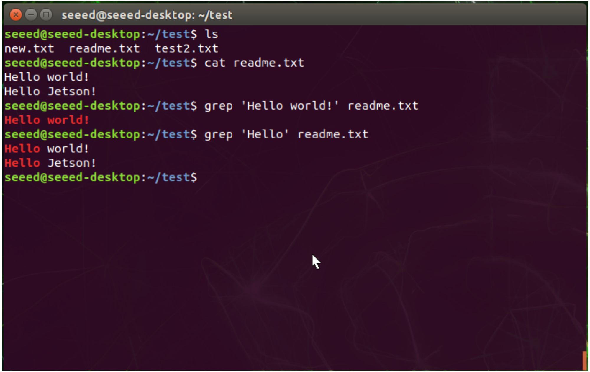

> 图 1.40 `grep` 指令实例图
>


> 更多指令可参考：[Linux 命令大全](https://www.runoob.com/linux/linux-command-manual.html)
>

---

# 5. 总结
在本课中，我们学习了嵌入式系统和边缘计算的核心概念，探索了人工智能、机器学习与边缘 AI 之间的联系，了解了边缘 AI 的优势及其应用领域。此外，我们还初步了解了 Jetson 硬件平台在边缘 AI 中的应用，并掌握了 JetPack 操作系统的一些基础操作和常用命令。  

# 6. 课后拓展
## 6.1. 思考题
+ 如果你可以为日常生活中的某个物品添加边缘 AI 功能，你会选择什么？希望它具备什么智能功能？
+ 为什么我们在不同场景下需要用到 ls 命令？在实际开发中，这个命令可以帮助我们解决什么问题？
+ 使用 cd 命令时，为什么路径管理会影响我们的文件管理效率？有什么技巧能提高效率？

## 6.2. 实践任务
### 终端命令练习
熟悉 Jetson 设备的操作：尝试启动设备，连接外设，打开终端，执行基本命令。

#### 练习 1：目录和文件管理
创建一个名为 my_project 的目录，在该目录内创建 README.md 文件，并在其中输入“Hello, Edge AI!”。

#### 练习 2：文件导航
进入 Documents 目录，列出该目录下的所有文件和文件夹。

#### 练习 3：复制与删除文件
创建一个名为 backup.txt 的文件，将其复制为 backup_copy.txt，然后删除原文件。


## 6.3. 课后阅读
- 访问 NVIDIA 官方文档，了解 Jetson Nano 的更多细节：[https://developer.nvidia.com/embedded-computing](https://developer.nvidia.com/embedded-computing)
- 提供 Python 编程的入门资料，可以建议学生提前了解：[https://docs.python.org/zh-cn/3/tutorial/index.html](https://docs.python.org/zh-cn/3/tutorial/index.html)
