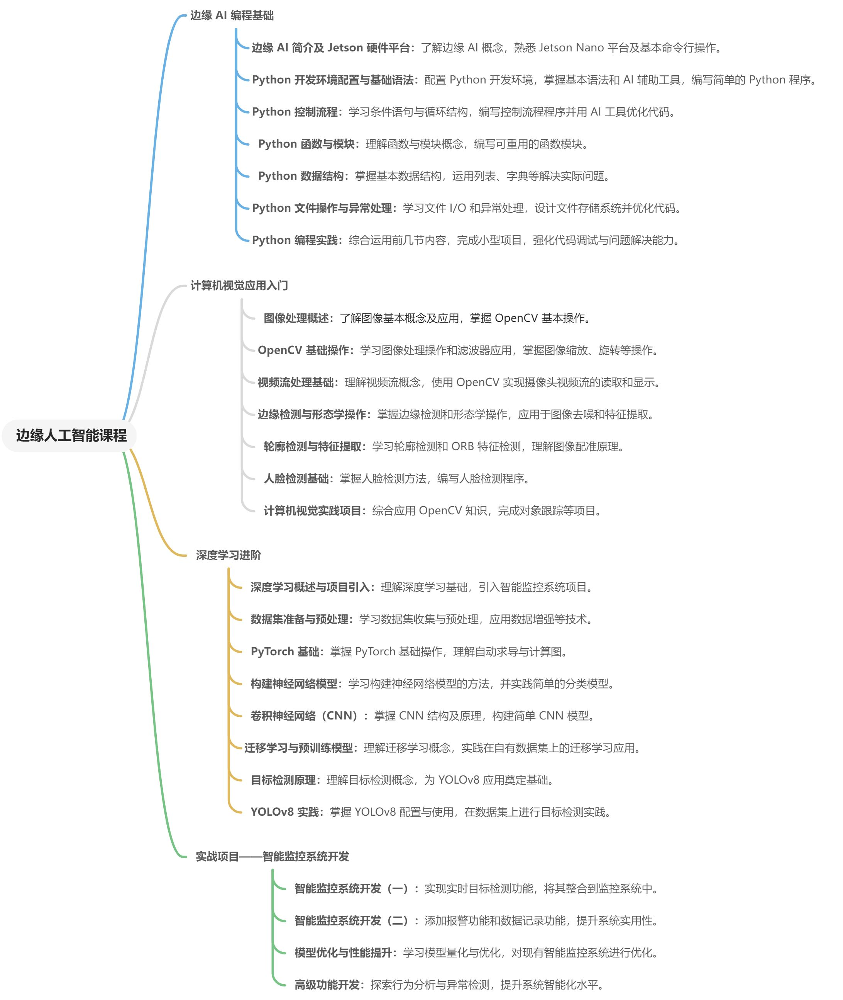

# Course Introduction
This course will guide you through a deep dive into the world of Edge AI, helping you master the fundamentals of Python programming, understand the basics of computer vision, and explore the applications of deep learning and Edge AI. By developing hands-on projects, you'll enhance your skills in AI application development.

**Main Course Content:**

1. **Fundamentals of Edge AI Programming**: Gain foundational knowledge in AI, learn the basics of Python programming, master command-line operations, and familiarize yourself with essential development tools, laying a solid groundwork for future AI projects.  
2. **Introduction to Computer Vision Applications**: Learn the basics of image processing and video stream analysis, and master OpenCV applications to build a strong visual foundation for intelligent surveillance systems.  
3. **Advanced Deep Learning**: Delve into neural networks and deep learning models, exploring AI applications on edge devices to establish a technical foundation for developing intelligent surveillance systems.  
4. **Practical Project - Intelligent Surveillance System Development**: Integrate acquired knowledge to complete the development of an intelligent surveillance system, including model optimization and system tuning, achieving real-world Edge AI applications.

> Course Content Structure
>

## Hardware Overview
**Jetson Hardware Platform**: The NVIDIA Jetson series is a high-performance hardware platform designed for Edge AI applications, offering robust computing power capable of running complex AI models. It is particularly well-suited for scenarios requiring edge computing, such as robots, drones, and smart cameras.

**reComputer J1020 v2**: The reComputer J1020 v2 is a development kit based on the Jetson Nano core module, featuring the following characteristics:

+ **Core Hardware**: Equipped with the Jetson Nano 4GB module, which includes a 128-core NVIDIA Maxwell GPU and a quad-core ARM Cortex-A57 CPU.
+ **AI Performance**: Provides 0.5 TOPS of AI performance, supporting tasks like deep learning and computer vision.
+ **Storage**: Comes with a 128GB NVMe M.2 SSD, enabling fast storage and retrieval of large datasets, suitable for AI data processing needs.
+ **Video Processing**: Supports up to 4K multi-channel video encoding and decoding, enabling real-time video processing.
+ **Rich Interfaces**: Includes USB, HDMI, Ethernet, and GPIO interfaces, allowing easy connection to various peripherals and sensors.

**Camera**: The Logitech C270 HD webcam works seamlessly with the Jetson Nano to capture high-quality video streams, providing data support for subsequent computer vision and AI applications.

## Software Overview
**JetPack Operating System**: JetPack is NVIDIA’s official software development kit (SDK) for the Jetson platform, based on Ubuntu. It integrates all the tools and libraries necessary for AI development, including:

+ **CUDA**: Utilized for GPU-accelerated computation, improving the speed of deep learning and other AI algorithms.
+ **cuDNN and TensorRT**: Provides acceleration for deep learning, ensuring efficient AI model execution on edge devices.
+ **Multimedia APIs**: Supports image and video processing, facilitating the handling of camera data.

**Python Development Environment**: The Jetson Nano supports Python programming, which is the primary language for this course. JetPack comes pre-installed with Python and related development tools, enabling students to carry out end-to-end development from data processing to AI inference. The course will introduce the following Python libraries:

+ **OpenCV**: For image processing and computer vision tasks.
+ **PyTorch**: A deep learning framework that supports the construction and training of neural networks.
+ **YOLOv8 Model**: Used for object detection, semantic segmentation, and keypoint detection, helping students quickly implement AI applications.
